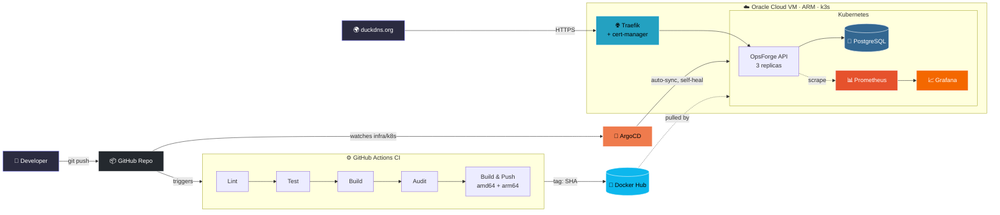
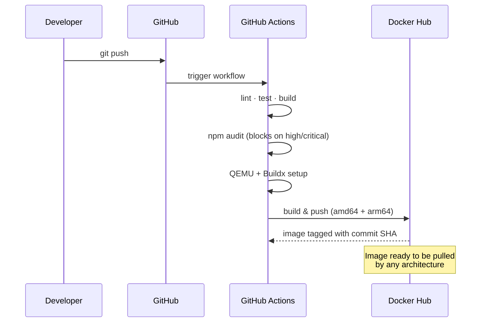
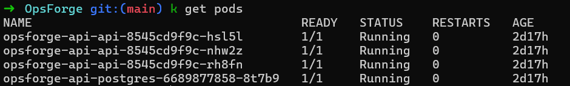
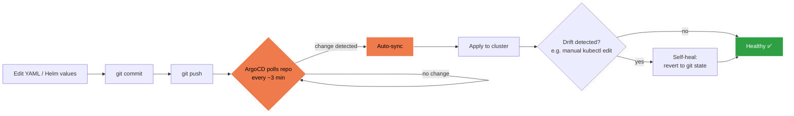
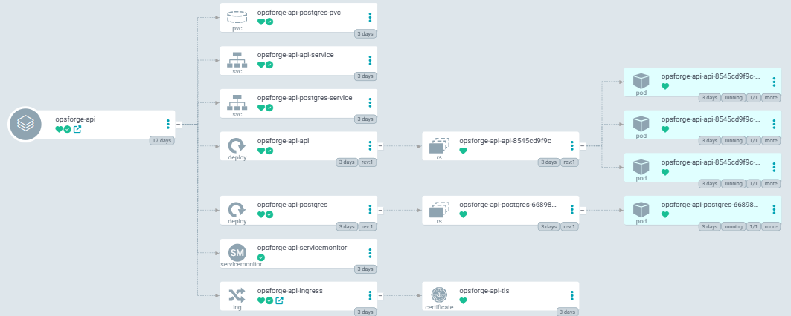
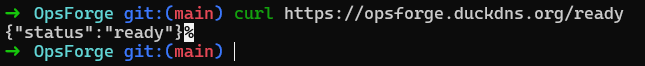
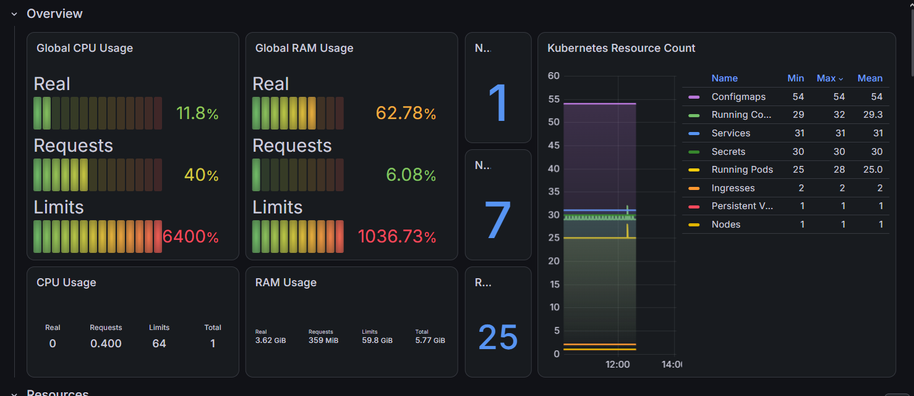

# OpsForge

A **production-grade DevOps platform** demonstrating modern CI/CD, GitOps, Kubernetes, observability, and cloud deployment on real infrastructure.

The application itself is intentionally minimal (Fastify API with health/readiness/metrics endpoints) — the project's real value is the infrastructure and operational automation around it.

**Status:** Fully deployed and running live on Oracle Cloud with automated GitOps syncing, HTTPS, and observability.

---

## Architecture



**The flow in words:** push code → CI builds/tests/scans/publishes a multi-arch image → ArgoCD notices any change to `infra/k8s/` and syncs it automatically → Traefik routes public HTTPS traffic into the cluster → the API talks to Postgres and reports metrics → Prometheus scrapes those metrics and Grafana visualizes them. No step after `git push` requires a human.

---

## What This Project Actually Demonstrates

✅ **Real problems solved:**
- Multi-architecture Docker builds (amd64 + arm64) — necessary because production VM runs on Oracle Ampere ARM, not typical x86
- Stale Docker volumes causing container failures — debugged and fixed with `docker compose down -v`
- Git divergence requiring manual conflict resolution
- Port forwarding silently failing due to cloud NAT — diagnosed via `ss`, solved with NodePort
- ESLint/TypeScript strict mode errors — fixed with proper type annotations
- Kubernetes resource conflicts — cleaned up old manifests to allow Helm to take over

✅ **Core deliverables:**
- CI pipeline that builds, tests, scans, and publishes multi-arch images automatically
- GitOps (ArgoCD) that auto-syncs any git change to the cluster — no manual `kubectl apply`
- Kubernetes running on real cloud infrastructure (Oracle Cloud ARM VM)
- HTTPS with auto-renewing certificates (cert-manager + Let's Encrypt)
- Ingress routing by hostname (DuckDNS domain)
- Observability stack (Prometheus + Grafana) showing cluster and application metrics
- Infrastructure as Code (Terraform) — proven via `terraform plan`, not applied against live system for safety
- Helm charts for reusable, parameterized deployments
- Secrets stored in Kubernetes, never hardcoded in git

---

## Tech Stack

| Component | Technology |
|-----------|------------|
| **Backend** | Node.js 20, TypeScript, Fastify |
| **Database** | PostgreSQL 16 |
| **Containers** | Docker (multi-stage, multi-arch) |
| **Container Registry** | Docker Hub |
| **CI/CD** | GitHub Actions |
| **Kubernetes** | k3s (lightweight distribution) |
| **GitOps** | ArgoCD |
| **Package Manager** | Helm 3 |
| **Ingress Controller** | Traefik (bundled with k3s) |
| **TLS/HTTPS** | cert-manager + Let's Encrypt |
| **Monitoring** | Prometheus |
| **Dashboards** | Grafana |
| **Infrastructure as Code** | Terraform (OCI provider) |
| **Cloud Provider** | Oracle Cloud Infrastructure (Always Free tier) |
| **VM Specs** | 1-4 OCPU, 6-24GB RAM, ARM (aarch64) |
| **Testing** | Vitest (in-memory, no network) |
| **Linting** | ESLint + @typescript-eslint |
| **Git Hooks** | Husky + commitlint |
| **Commit Convention** | Conventional Commits |

---

## Repository Structure

```
opsforge/
├── apps/
│   └── api/
│       ├── src/
│       │   ├── app.ts              # Fastify app definition
│       │   ├── index.ts            # Server startup
│       │   └── app.test.ts         # Vitest tests
│       └── Dockerfile              # Multi-stage build
├── infra/
│   ├── terraform/                  # IaC for Oracle Cloud
│   │   ├── main.tf
│   │   ├── variables.tf
│   │   └── terraform.tfvars        # (gitignored, secrets)
│   └── k8s/
│       ├── helm-chart/             # Helm chart for app
│       │   ├── Chart.yaml
│       │   ├── values.yaml
│       │   └── templates/
│       │       ├── deployment.yaml
│       │       ├── service.yaml
│       │       ├── ingress.yaml
│       │       ├── postgres.yaml
│       │       └── servicemonitor.yaml
│       └── argocd-app.yaml         # ArgoCD Application resource
│       └── cluster-issuer.yaml     # cert-manager ClusterIssuer
├── .github/
│   └── workflows/
│       └── ci.yml                  # GitHub Actions pipeline
├── docker-compose.yml              # Local dev stack
├── docker-compose.override.yml     # Bind-mount for hot reload
├── package.json
├── tsconfig.json
├── eslint.config.js
└── README.md
```

---

## CI/CD Pipeline

Every `git push` to `main` automatically triggers GitHub Actions:

1. **Checkout** repository code
2. **Setup** Node.js 20 with dependency caching
3. **Install** dependencies (`npm ci`)
4. **Lint** with ESLint + TypeScript
5. **Test** with Vitest (in-memory, fast)
6. **Build** TypeScript to JavaScript
7. **Security audit** — blocks pipeline on high/critical vulnerabilities
8. **Set up QEMU** (for ARM emulation on amd64 runners)
9. **Set up Docker Buildx** (multi-platform builder)
10. **Build & push Docker image** to Docker Hub
    - Builds for both `linux/amd64` AND `linux/arm64` in parallel
    - Tags with full commit SHA (e.g. `mouadmodnibi/opsforge-api:a353713bb136...`)
    - Layer caching via GitHub Actions cache (faster subsequent builds)

**Result:** Every successful push produces a working, multi-architecture image on Docker Hub within ~4-8 minutes.




---

## Kubernetes Deployment

Runs on **k3s** (lightweight Kubernetes) on a single Oracle Cloud VM (ARM-based).

### Core Resources

**OpsForge API:**
- `Deployment` with 3 replicas (high availability)
- `Service` (ClusterIP) — internal routing
- `Ingress` — external routing via Traefik, HTTPS via cert-manager
- Auto-exposes via domain `opsforge.duckdns.org`


**PostgreSQL:**
- `Deployment` with 1 replica (single instance, intentional)
- `PersistentVolumeClaim` — data survives pod restarts
- `Service` (ClusterIP) — accessible by DNS name `postgres-service`
  

*All pods running: 3 API replicas, 1 Postgres instance, all healthy.*

**Secrets:**
- `postgres-secret` — DB password
- `api-secret` — `DATABASE_URL` connection string
- Never stored in git, injected at runtime

**Monitoring:**
- `ServiceMonitor` — tells Prometheus to scrape the API's `/metrics` endpoint

---

## GitOps with ArgoCD

**ArgoCD continuously watches this repository** — specifically the `infra/k8s/helm-chart/` path.

Any change committed and pushed automatically deploys:

```bash
# Developer workflow:
git commit -m "feat(k8s): scale api to 4 replicas"
git push

# ArgoCD detects the change within 3 minutes
# Automatically updates the cluster
# No manual kubectl required
```

**Sync policies enabled:**
- `automated: true` — auto-sync on git change
- `prune: true` — delete resources removed from git
- `selfHeal: true` — revert manual `kubectl` changes back to git state

**Git is the single source of truth** for cluster state.




*The `opsforge-api` Application, synced and healthy, tracking the Helm chart in `infra/k8s/helm-chart`.*

---

## HTTPS & Networking

**Ingress Controller:** Traefik (bundled with k3s)

**Domain:** DuckDNS (free, dynamic DNS — no domain purchase needed)
- `opsforge.duckdns.org` → automatically resolves to VM's public IP

**TLS Certificates:** Automated with cert-manager + Let's Encrypt
- Requests certificate automatically on first deploy
- Auto-renews 30 days before expiry
- Zero manual certificate management

**Result:** HTTPS works out-of-the-box, with valid certificates recognized by all browsers.


*A real request to `https://opsforge.duckdns.org/ready` — valid HTTPS, returning a live Postgres-backed readiness check.*

---

## Observability

### Prometheus

Scrapes metrics from:
- **API endpoint** (`/metrics`) — application-level metrics
- **kube-state-metrics** — Kubernetes resource state
- **node-exporter** — VM-level metrics (CPU, memory, disk, network)

Stores time-series data. Retention: configurable (default ~15 days).

### Grafana

Pre-configured dashboards visualize:
- Kubernetes cluster health (node status, pod counts, resource usage)
- CPU and memory usage (real vs requests vs limits)
- Application request rate, latency, error rate (RED method)
- Pod restart counts and uptime

Accessible at: `https://opsforge.duckdns.org:3000` (or configured port)


*Live cluster metrics: CPU/RAM usage, resource counts (Pods, Services, Secrets, Ingresses), all updating in real time.*

### Application Metrics

The Fastify API exposes:

```typescript
GET /metrics
```

Metrics collected (via `prom-client`):
- `opsforge_http_requests_total` — counter, labeled by method/route/status
- `opsforge_http_request_duration_seconds` — histogram, for percentile calculations
- Node.js runtime metrics (CPU, memory, GC, event loop lag)

---

## Application Endpoints

| Route | Purpose | Response |
|-------|---------|----------|
| `GET /health` | Liveness probe — is the process up? | `200 {"status":"ok","uptime":...,"timestamp":"..."}` |
| `GET /ready` | Readiness probe — can this pod serve traffic? Connects to Postgres. | `200 {"status":"ready"}` or `503 {"status":"not ready"}` |
| `GET /metrics` | Prometheus metrics in OpenMetrics text format | `# HELP opsforge_http_requests_total ...` |

---

## Local Development

### Clone and install

```bash
git clone https://github.com/MouadModnibi/OpsForge.git
cd OpsForge
npm install
```

### Start the full stack locally

```bash
docker compose up --build
```

Brings up:
- **API** at `http://localhost:3000`
- **PostgreSQL** at `localhost:5432`
- **Redis** at `localhost:6379` (for future use)

### Run tests and lint

```bash
npm run lint    # ESLint
npm test        # Vitest
npm run dev     # Watch mode (via tsx)
```

### Verify endpoints

```bash
curl http://localhost:3000/health
curl http://localhost:3000/ready
curl http://localhost:3000/metrics
```

---

## Production Deployment

**Infrastructure provisioning** (Terraform, not currently applied against live VM for safety):

```bash
cd infra/terraform
terraform init
terraform plan   # Review what would be created
```

**Kubernetes cluster** (k3s on Oracle Cloud ARM VM):

```bash
# Already deployed and running
# Access via: https://opsforge.duckdns.org/
```

**GitOps deployment** (ArgoCD):

```bash
# Automatic — any git change syncs within 3 minutes
# No manual `kubectl apply` needed
```

---

## Infrastructure as Code (Terraform)

Terraform configuration validates but is not applied against the live system (for safety, since the production VM already exists).

**What Terraform defines:**
- Oracle Cloud VCN (Virtual Cloud Network)
- Internet Gateway
- Route table (0.0.0.0/0 → IGW)
- Security list (ports 22, 80, 443, 6443)
- Subnet
- Compute instance (VM.Standard.A1.Flex shape, ARM)
- Ubuntu 24.04 image selection

**Usage (validated only):**

```bash
cd infra/terraform
terraform init
terraform plan    # Shows what would be created
```

**To apply against a fresh environment** (not recommended against live system):

```bash
terraform apply
```


## Future Improvements

The following are *designed for* but not yet implemented:

- Helm subchart dependencies (Redis, external logging)
- Horizontal Pod Autoscaler (HPA) based on request rate
- Loki for centralized log aggregation
- Tempo for distributed tracing
- OpenTelemetry instrumentation
- Multiple environments (dev/staging/prod) via Helm values
- Kubernetes NetworkPolicies (zero-trust networking)
- External Secrets Operator (pull secrets from Vault)
- Backup & restore automation for PostgreSQL
- Blue/Green deployments
- Kyverno policy enforcement
- Ansible playbooks for automated cluster bootstrap


