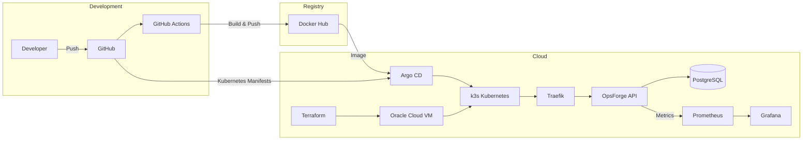

# OpsForge

> A production-style DevOps platform demonstrating CI/CD, GitOps, Infrastructure as Code, Kubernetes, Monitoring, and Cloud deployment.

OpsForge is a self-hosted DevOps platform built to simulate how modern cloud-native applications are developed and deployed in production.

While the API itself is intentionally simple, the project focuses on everything around it:

- Infrastructure as Code with Terraform
- Continuous Integration with GitHub Actions
- Docker multi-architecture builds
- Kubernetes (k3s)
- GitOps with Argo CD
- HTTPS using Traefik + cert-manager + Let's Encrypt
- Monitoring with Prometheus & Grafana
- Deployment on Oracle Cloud Infrastructure (OCI)

---

# Architecture



# Features

- Infrastructure provisioned with Terraform
- GitHub Actions CI pipeline
- Docker multi-stage & multi-architecture builds
- Docker Hub image publishing
- Kubernetes (k3s)
- GitOps using Argo CD
- HTTPS with Traefik + cert-manager + Let's Encrypt
- PostgreSQL with Persistent Volumes
- Kubernetes Secrets
- Prometheus monitoring
- Grafana dashboards
- Health & readiness endpoints
- Application metrics using Prometheus
- Conventional Commits
- Husky Git hooks
- ESLint
- Vitest

---

# Tech Stack

| Category | Technologies |
|-----------|--------------|
| Backend | Node.js, TypeScript, Fastify |
| Database | PostgreSQL |
| Cache | Redis |
| Containers | Docker, Docker Compose |
| CI | GitHub Actions |
| Registry | Docker Hub |
| IaC | Terraform |
| Kubernetes | k3s |
| GitOps | Argo CD |
| Ingress | Traefik |
| TLS | cert-manager + Let's Encrypt |
| Monitoring | Prometheus |
| Dashboards | Grafana |
| Cloud | Oracle Cloud Infrastructure |
| Testing | Vitest |
| Linting | ESLint |

---

# Project Structure

```
opsforge/
│
├── apps/
│   └── api/
│       ├── src/
│       │   ├── app.ts
│       │   ├── index.ts
│       │   └── app.test.ts
│       └── Dockerfile
│
├── infra/
│   ├── terraform/
│   │   ├── main.tf
│   │   ├── variables.tf
│   │   └── terraform.tfvars
│   │
│   └── k8s/
│       ├── deployment.yaml
│       ├── service.yaml
│       ├── ingress.yaml
│       ├── postgres.yaml
│       ├── secrets.yaml
│       ├── servicemonitor.yaml
│       └── clusterissuer.yaml
│
├── .github/
│   └── workflows/
│       └── ci.yml
│
├── docker-compose.yml
├── docker-compose.override.yml
├── package.json
└── README.md
```

---

# CI/CD Pipeline

Every push to `main` triggers GitHub Actions.

The pipeline performs:

1. Checkout repository
2. Install dependencies
3. ESLint
4. Run tests (Vitest)
5. Build TypeScript
6. Security audit (`npm audit`)
7. Build Docker image
8. Build multi-architecture image (`amd64` + `arm64`)
9. Push image to Docker Hub
10. Update Kubernetes manifests
11. Argo CD detects changes and deploys automatically

---

# Infrastructure

The infrastructure is provisioned using **Terraform** on **Oracle Cloud Infrastructure (OCI)**.

Terraform manages:

- Compute Instance
- Virtual Cloud Network
- Security Rules
- SSH Keys
- Networking

This allows the complete infrastructure to be recreated from code.

---

# Kubernetes

The application runs on a **k3s Kubernetes cluster**.

Resources include:

- Deployment
- Service
- Ingress
- Secrets
- PersistentVolumeClaim
- Configurations managed by Git

The API is deployed with **3 replicas** for high availability.

PostgreSQL uses persistent storage so data survives pod restarts.

---

# GitOps

Argo CD continuously watches this repository.

Whenever Kubernetes manifests change:

```
Git Commit
        │
        ▼
GitHub Repository
        │
        ▼
Argo CD
        │
        ▼
Kubernetes Cluster
```

No manual `kubectl apply` commands are required.

Git becomes the single source of truth.

---

# HTTPS

The application is exposed through:

- Traefik Ingress
- cert-manager
- Let's Encrypt

Certificates are automatically:

- Requested
- Installed
- Renewed

---

# Monitoring

The project includes a complete monitoring stack.

## Prometheus

Prometheus automatically scrapes:

- Kubernetes metrics
- Node metrics
- Application metrics

The Fastify API exposes:

```
GET /metrics
```

using **prom-client**.

Collected metrics include:

- HTTP Requests
- Request Duration
- CPU Usage
- Memory Usage
- Event Loop
- Garbage Collection

---

## Grafana

Grafana is connected to Prometheus.

Dashboards visualize:

- CPU Usage
- Memory Usage
- Pod Status
- Node Status
- Request Rate
- Request Duration
- Error Rate
- Kubernetes Cluster Health

---

# Application Endpoints

| Endpoint | Description |
|-----------|-------------|
| `/health` | Liveness Probe |
| `/ready` | Readiness Probe |
| `/metrics` | Prometheus Metrics |

---

# Local Development

Clone the repository

```bash
git clone https://github.com/MouadModnibi/OpsForge.git
```

Install dependencies

```bash
npm install
```

Start locally

```bash
docker compose up --build
```

Application:

```
http://localhost:3000
```

Metrics:

```
http://localhost:3000/metrics
```

---

# Production Stack

Oracle Cloud VM

↓

Terraform

↓

k3s Kubernetes

↓

Traefik

↓

HTTPS

↓

OpsForge API

↓

PostgreSQL

↓

Prometheus

↓

Grafana

---

# Future Improvements

- Helm Charts
- Horizontal Pod Autoscaler
- Loki for centralized logging
- Tempo for distributed tracing
- OpenTelemetry
- Multiple environments (Development / Staging / Production)
- Kubernetes Network Policies
- External Secrets
- Backup & Restore automation
- Blue/Green Deployments

---

# What This Project Demonstrates

- Infrastructure as Code
- CI/CD
- GitOps
- Docker
- Kubernetes
- Cloud Deployment
- Monitoring
- Observability
- Production-style architecture
- Secure HTTPS deployment
- Multi-architecture container builds
- Modern DevOps practices

---

# Author

**Mouad Modnibi**

Engineering Student in Networks & Information Systems

Interested in:

- DevOps
- Cloud Computing
- Platform Engineering
- Kubernetes
- Infrastructure as Code
- Site Reliability Engineering (SRE)
- AI

GitHub: https://github.com/MouadModnibi
